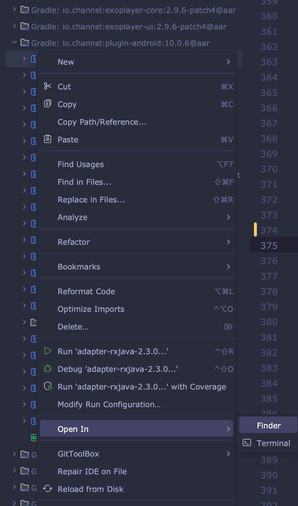

# 라이브러리 업데이트가 안될 때

## 라이브러러 업데이트가 안되는 상황

- 라이브러리 또는 오픈소스 버전을 업그레이드(10.0.6 -> 11.0.1) 했는데 **External Libraries**에선 여전이 10.0.6 을 가리키고 있을 때가 있습니다. (가끔 혹은 처음 / 회사 또는 개인)
- 로컬 Gradle 캐시를 의심해 봐야 합니다.
- 재밌는 것은(당사자는 노잼), 동료들은 괜찮은데 나만 그렇다는 겁니다.

## 해결하기(결론)

- 해당 안드로이드 프로젝트 디렉토리가 아닌 **외부에** 숨겨진 .gradle 에서 해당 라이브러리 캐시를 찾아서 관련 파일을 모두 제거후에 빌드 해야 합니다
  - 경로는, /Users/{유저명}/.gradle/caches/ 입니다.
  - 안.스의 External Libraries -> Gradle:{라이브러리 namespace} -> 커서메뉴(마우스 메뉴) -> 커서메뉴의 Open In > Finder 선택
    - 
    - 처음부터 Finder 나 Terminal 로 들어가서 해당 라이브러리의 폴더를 찾기란 어렵습니다.
      - 라이브러리 폴더명이 해시코드와 유사하기 때문입니다.
      - 폴더 뎁스도 제법 있을 수 있어요.
- 해당 라이브러리 캐시를 찾아 관련 파일을 모두 제거 후에 안.스를 열고 빌드를 하면 당연히 빌드 에러가 발생합니다.
- **Sync Project with Gradle Files** 하여 프로젝트와 Gradle 을 동기화 하면 라이브러리가 정상적으로 업데이트 된 것을 확인할 수 있습니다.
- 혹시 문제가 여전하다면, 라이브러리 버전을 바꾸어 가며 테스트 해보시기 바랍니다. 반드시 될 겁니다 : )

## 실패 했던 시도

- dependencies {...} 에 참조되어 있던 버전 무수히 바꿔보기
  - 다운그레이드 -> 업그레이드 -> 다운그레이드 -> 업그레이드 -> ...
- Clean Project
- Invalidate and Restart
- .git 제거
- 프로젝트 제거 -> 원격 Git 으로부터 clone -> 안.스에서 Import